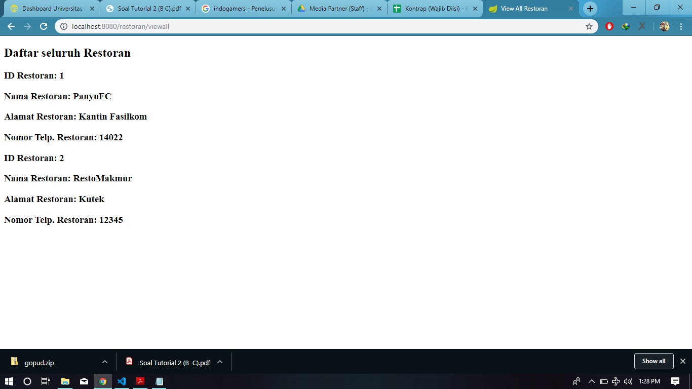

# Tutorial APAP

## Authors

* **nur.rifandy** - *1706984695* - *APAP-C*

## Tutorial 3

1. Pada class MenuDb, terdapat method findByRestoranIdRestoran , apakah kegunaan dari
method tersebut?
method tersebut digunakan untuk mengambil semua menu yang berelasi dengan idRestoran. Atau dalam kata lain untuk mengambil mendapatkan list menu dari sebuah restoran berdasarkan id restoran tersebut. 

2. Pada class RestoranController, jelaskan perbedaan method addRestoranFormPage dan
addRestoranSubmit?
addRestoranFormPage merupakan method yang mengembalikan halaman yang berisi form.
sedangkan, addRestoranSubmit merupakan method yang berfunsi debagai action setelah seseorang mengisi form dan mensubmit datanya 

3. Jelaskan apa kegunaan dari JPA Repository?
JPA Repository merupakan sebuah merupakan sebuah standar spesifikasi tentang bagaimana cara mengakses database di Java. JPA juga dirakit dengan funsi CRUD dasar untuk mempermudah dalam mengakses data dan membangun aplikasi.

4. Sebutkan dan jelaskan di bagian kode mana sebuah relasi antara RestoranModel dan
MenuModel dibuat?
File : MenuModel.java
    @ManyToOne(fetch = FetchType.EAGER,optional=false)
    @JoinColumn(name="restoranId", referencedColumnName = "idRestoran", nullable=false)
    @OnDelete(action= OnDeleteAction.CASCADE)
    @JsonIgnore
    private RestoranModel restoran;

pada code di atas, dapat kita ketahui ketika sebuah entity pada model MenuModel maka relasi ManyToOne antara MenuModel ke RelationalModel akan terbentuk.

File : RestoranModel.java
    @OneToMany(mappedBy="restoran", fetch = FetchType.LAZY, cascade= CascadeType.ALL)
    private List<MenuModel> listMenu;

Begitupun pada RestoranModel akan terbentuk relational dengan MenuModel berdasarkan kode di atas.

5. Jelaskan kegunaan FetchType.LAZY , CascadeType.ALL , dan FetchType.EAGER
FetchType.LAZY = pengambilan data bergantung pada kebutuhan. Hanya ketika dilakukan pemanggilan getter pada suatus attribut.

CascadeType.ALL = tipe ini memungkinkan apabila terjadi perubahan terhadap sebuah entity, maka entity yang berelasi dengannya akan ikut mengalama perubahan.

FetchType.EAGER = pengambilan data langsung bersamaan dengan entitas parentsnya.

## Tutorial 2

1. There was an unexpected error (type=Internal Server Error, status=500).
Error resolving template [add-restoran], template might not exist or might not be accessible by any of the configured Template Resolvers

Error tersebut terjadi karena template "add-restoran" belum di tambahkan.

2. This application has no explicit mapping for /error, so you are seeing this as a fallback.

Wed Sep 18 11:31:02 ICT 2019
There was an unexpected error (type=Bad Request, status=400).
Required String parameter 'nomorTelepon' is not present

terdapat parameter yang tidak terpenuhi sehingga menyebabkan error bad request 

3. http://localhost:8080/restoran/view?idRestoran=1

4. Resto baru = http://localhost:8080/restoran/add?idRestoran=2&nama=RestoMakmur&alamat=Kutek%2
0Fasilkom&nomorTelepon=12345

----
## Tutorial 1
### What I have learned today
(Masukkan pertanyaan yang diikuti jawaban di setiap nomor, contoh seperti dibawah. Anda juga boleh
menambahkan catatan apapun dibagian ini)
#### Github
1. Apa itu Issue Tracker? Masalah apa yang dapat diselesaikan dengan Issue Tracker?
Issue Tracker merupakan tempat yang digunakan untuk membahas dan melakukan sebuah tracking terhadap sebuah bug ataupun issue yang sedang ada.
Masalah-masalah yang dapat diselesaikan:
- Request fitur
- Report Bug
- Memperbarui Code
- Improvement atau memperbaiki Code

2. Apa perbedaan dari git merge dan merge --squash?
Perbedaan : 
- ketika melakukan git merge maka setiap commit yang terdapat di branch akan tertulis semua di master
- Sedangkan ketika melakukan merge --squash commit yang terdapat di master hanya akan terdapat 1 commit, dan membuat log lebih bersih
#### Spring
3. Apa itu library & dependency?
- Library
merupakan sebuah code yang telah disediakan dan bisa digunakan oleh pengguna.
-Dependency
merupakan library yang dibutuhkan dalam menjalankan project.
4. Apa itu Maven? Mengapa kita perlu menggunakan Maven?
- Maven meruapakan project manager dependency. Diperlukan karena untuk memanage dan mengkonfigurasi dependency-dependency yang dibutuhkan agar lebih mudah.
5. Apa alternatif dari Maven?
Gradle

### What I did not understand
(tuliskan apa saja yang kurang Anda mengerti, Anda dapat men-_check_ apabila Anda sudah mengerti
dikemudian hari, dan tambahkan tulisan yang membuat Anda mengerti)
- [ ] Kenapa saya harus belajar APAP?
- [x] Kenapa?
Dikarenakan agar dapat mengerti dan memahami bagaimana pembuatan aplikasi bersekala besar. Karena pada dasarnya perancangan aplikasi yang berskala besar dan berskala perorangan sangatlah berbeda.
Apalagi dengan aplikasi yang bersifat enterprise.
