# Tutorial APAP

## Authors

* **nur.rifandy** - *1706984695* - *APAP-C*

## Tutorial 8

### Latihan 
1. Menambahkan condition di dalam Item.js, dimana jika 'checked' bernilai false maka checked tidak akan di tampilkan. dan baru akan di tampilkan pada bagian kiri ketika checked bernilai true.

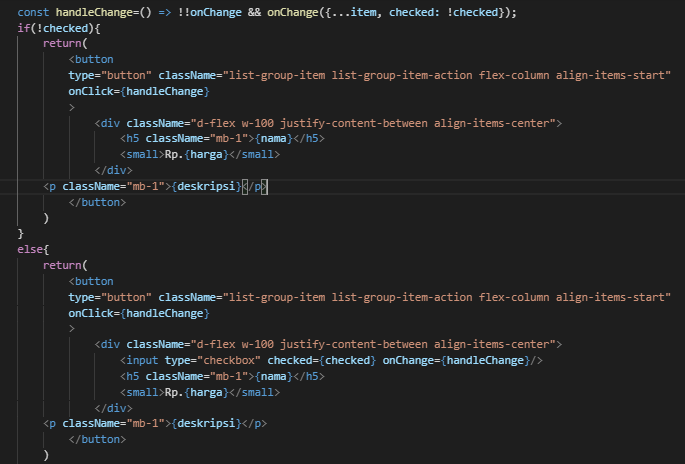

2. Membuat function baru pada App.js. dimana function tersebut tidak akan menghilangkan menu yang telah di pilih sebagai menu favorite.

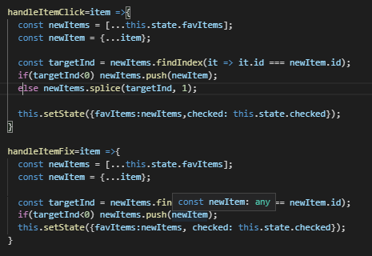
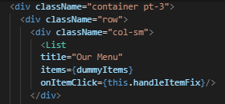

3. Membuat sebuah function yang akan menghandle untuk menampilkan dan menyembunyikan menu favorite, serta menambahkan flag "true or false" untuk menentukan menu tersebut di tampilkan atau tidak.

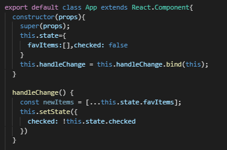
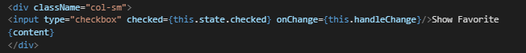

4. Membuat components baru bernama EmptyState, dimana component tersebut mengembalikan html yang menunjukkan bahwa belum ada menu yang dipilih. Serta untuk memilih tampilan mana yang akan di tampilkan, maka dibuat content yang berisi sesuai condition yang telah dipilih.

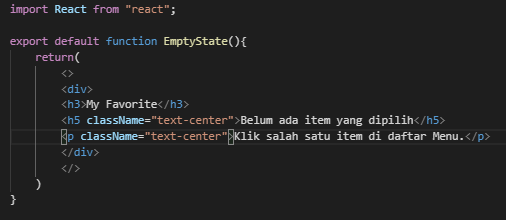
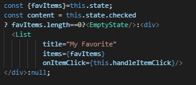

Referensi dalam pengerjaan : https://stackoverflow.com/questions/36134236/how-to-hide-or-show-a-div-if-checkbox-is-selected-in-react-js

## Tutorial 7

1. Jelaskan secara singkat perbedaan Otentikasi dan Otorisasi! Di bagian mana (dalam kode yang telah anda buat) konsep tersebut diimplementasi?
Otentikasi merupakan proses untuk memastikan/memverifikasi bahwa user yang melakukan akses adalah user yang benar. 
            .anyRequest().authenticated()
            .and()
            .formLogin()
            .loginPage("/login").permitAll()
            .and()
            .logout().logoutRequestMatcher(new AntPathRequestMatcher("/logout")).logoutSuccessUrl("/login").permitAll();

Otorisasi merupakan pemberian izin pengguna sesuai dengan hak dan role dari setiap pengguna.
            .authorizeRequests()
            .antMatchers("/css/**").permitAll()
            .antMatchers("/js/**").permitAll()
            .antMatchers("/restoran/**").hasAnyAuthority("MERCHANT")
            .antMatchers("/user/addUser").hasAnyAuthority("ADMIN")

2. Apa itu BCryptPasswordEncoder? Jelaskan secara singkat cara kerjanya!
BCryptPasswordEncoder merupakan algoritma atau model yang dapat digunakan untuk mengenkripsi sebuah password, dari sebuah string yang mudah untuk di baca menjadi string yang sulit untuk di baca. password yang di input oleh user akan di enkripsi menjadi sebuah sebuah string. String tersebut merupakan gabungan dari kode algorithm, Algorithm options, Salt, dan Hashed password.  

3. Jelaskan secara singkat apa itu UUID dan mengapa kita memakai UUID di UserModel.java?
UUID merupakan kode identifikasi unik yang diberikan oleh sistem, nilai yang di sediakan oleh UUID mempunyai panjang 128bit yang pada dasarnya merepresentasikan sebuah objek. Alasan menggunakan UUID pada kelas UserModel.java adalah agar data yang disimpan dapat terdistribusi dengan baik, selain itu penggunaan UUID dapat meningkatkan keamanan data user.

4. Apa kegunaan class UserDetailsServiceImpl.java? Mengapa harus ada class tersebut padahal kita sudah memiliki class UserRoleServiceImpl.java?
UserDetailsServiceImpl digunakan untuk mendefinisikan data user yang sedang login untuk dilakukan authorization server.
Kelas tersebut merupakan implement dari library UserDetailsService yang dapat digunakan untuk mempermudah dalam proses authorization.

## Tutorial 6
1. Apa itu postman? Apa kegunaan dari postman?
Postman merupakan sebuah aplikasi/tools yang digunakan untuk menguji atau melakukan testing terhadap website, seperti testing api, dan rest yang dibuat oleh seorang developer. 

2. Apa kegunaan dari annotation @JsonIgnoreProperties?
Biasanya digunakan untuk untuk mencari beberapa properti di json yang secara tidak langsung tidak ingin di tulis/tidak ingin di petakan.

3. Apa itu ResponseEntity dan apa kegunaannya?
ResponEntity biasanya digunakan untuk memberi response untuk sebuah request yang biasanya digunakan ketika melakukan test menggunakan api. 

## Tutorial 5

“If it's worth building, it's worth testing.
If it's not worth testing, why are you
wasting your time working on it?”
–Scott Ambler.

### Latihan
1. - Sebelum
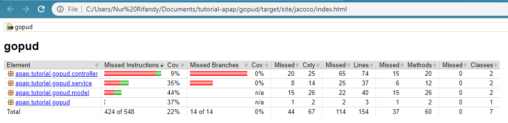

- Sesudah
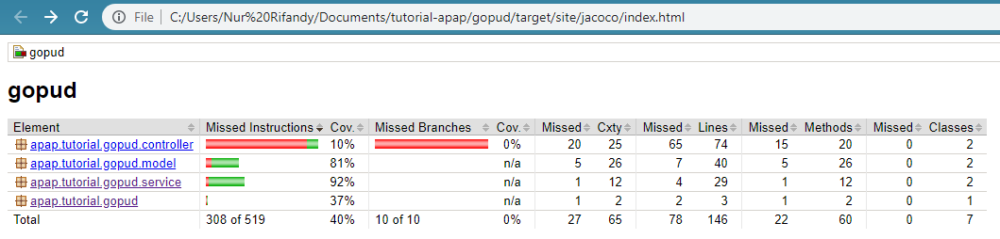

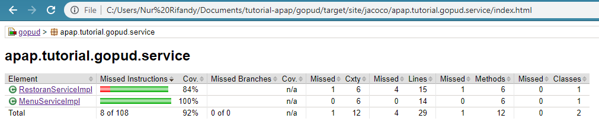

2. - Sebelum
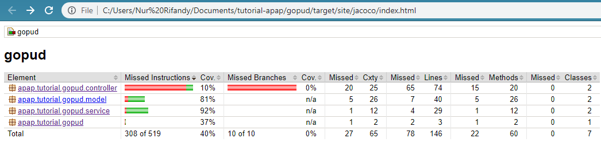

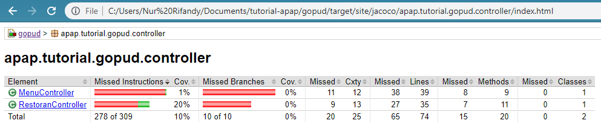
- Sesudah

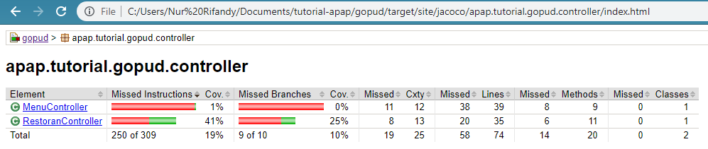

3. - Sebelum
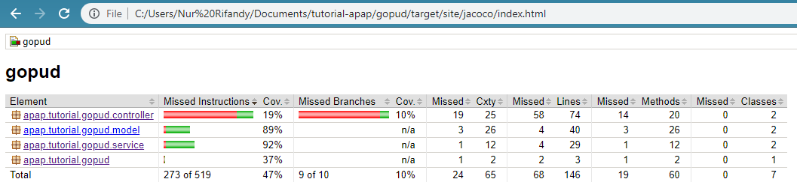

- Sesudah
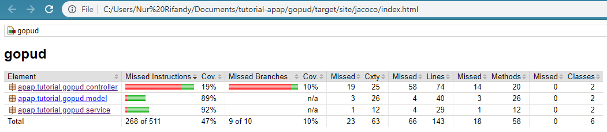

### Pertanyaan

1. Jelaskan bagian mana saja dari test yang dibuat pada latihan no 2 adalah given, when, dan and
then.
- bagian given merupakan bagian pada tahap inisiasin pada test nomer 2 hingga statement when.
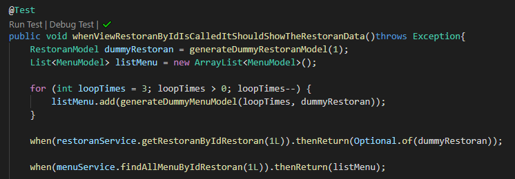

- bagian when merupakan bagian dari kondisi dan interaksi yang di test.
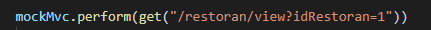

- bagian andthen merupakan hasil interaksi yang diharapkan, pada soal nomor 2 ini yaitu terdapat pada:
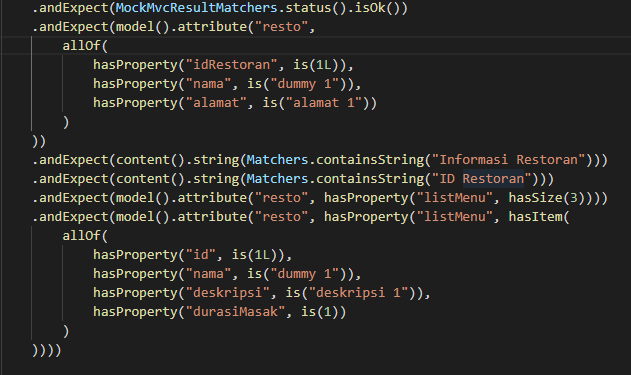

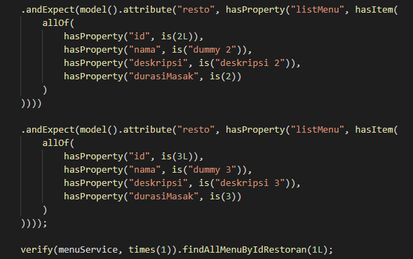

2. Jelaskan perbedaan line coverage dan logic coverage.
- line coverage melakukan testing terhadap setiap line, sedangkan logic coverage melakukan testing terhadap logic method.

3. Pada keadaan ideal, apa yang seharusnya dibuat terlebih dahulu, code atau unit test? Mengapa
seperti itu? Apa akibatnya jika urutannya dibalik, adakah risiko tak terlihat yang mungkin
terjadi?
- Unit test dibuat terlebih dahulu. Agar arsitektur yang dirancang tidak dibuat secara sembarangan sesuai keinginan developer. Penulisan working code jika dibuat Unit test terlebih dahulu sebisa mungkin merupakan code yang minimum namun dapat mencapai tujuan yaitu test-nya pass. Pembuatan working code lebih terstruktur dan terarah.
- Jika urutannya dibalik, maka terdapat kecenderungan bahwa pembuatan method, class dan behavior di dalamnya bersifat bebas sesuai keinginan developer karena semua yang dia buat dianggap benar, dan test yang dibuat harus mengikuti code yang telah dirancang. Padahal bisa saja, kode yang di tulis sulit untuk dilakukan test atau implementasi yang di terapkan terlalu kompleks.

4. [Bonus] Jelaskan mengapa pada latihan no 3, main class spring tidak diikutsertakan ke dalam
perhitungan coverage? Apa saja yang dapat menyebabkan suatu class dapat di-exclude dari
perhitungan code coverage.
- Karena pada main class tidak terdapat method yang bersifat logic, atau behavior yang melakukan interaksi dengan method pada kelas lain atau db.
- Yang dapat menyebabkan suatu class tidak di ikutsertakan atau di exclude pada code coverage, yaitu class tersebut tidak melakukan logic method, atau behavior yang melakukan interaksi dengan method, db atau class lain.

“Success is no accident. It is hard work, perseverance, learning,
studying, sacrifice and most of all, love of what you are doing or
learning to do.”
–Pelé, Brazilian football legend.

## Tutorial 4

1. Jelaskan yang anda pelajari dari melakukan latihan nomor 2, dan jelaskan tahapan bagaimana
anda menyelesaikan latihan nomor 2
kemudahan fragment dalam membuat sebuah template yang dapat digunakan oleh semua file html, dengan menggunakan fragment kita dapat meminimalisir penggunaan code yang sama dan digunakan secara berulang ulang.

tahapan penyelesaian : 
- membuat fragment pada filie fragment.html dengan sebuah nama headerFragment dan sebuah parameter untuk mendapatkan title dari setiap page.
- setiap html yang akan di tampilkan pada sebuah page akan menggunakan fragment tersebut atau memanggil fragment tersebut dengan sebuah prameter yang telah diisi dengan title dari page tersebut.

2. Jelaskan yang anda pelajari dari latihan nomor 3, dan jelaskan tahapan bagaimana anda
menyelesaikan latihan nomor 3
Pada latihan nomer 3, soal cukup susah di pecahkan. Namun dengan beberapa referensi dan documentasi dari thymeleaf sehingga pada akhirnya dapat diselesaikan. pada latihan 3 ini terdapat pembelajaran baru yang di dapat adalah thymeleaf memungkin user untuk melakukan penambahan form atau duplicate form tanpa perlu menggunakan js. Selain itu, dari latihan nomor 3 juga dapat belajar menggunakan penyimpanan data sementara sebelum semua data dikirimkan.

tahapan penyelesaian:
- menyediakan sebuah array sebagai penyimpanan sementara untuk setiap data yang dimasukkan.
- kemudian untk menampilkan row lebih dari 1 maka akan dilakukan iterasi sesuai pentambahan banyak object menunya.
- untuk proses penghapusan row, maka akan di hapus berdasarkan indexnya/idrow.
- dan setelah data pada setiap field di isi, maka dapat dilakukan submit, yang akan memproses penambahan menu secara bersamaan.

3. Jelaskan perbedaan th:include dan th:replace
th:include akan memasukkan konten fragmen ke hostnya
sedangkan, th:replace akan menggantikan tag host dengan fragment.

4. Jelaskan bagaimana penggunaan th:object beserta tujuannya
penggunaan th:object diharuskan oleh thymeleaf ketika pengguna mengguna sebuah tag form. cara penggunaannya yaitu dengan di deklarasikan pada tag form, th:object-> dengan ekspresi variable (${nama varible}) yang menentukan nama attribut properti.
tujuannya adalah untuk megatur atau menentukan sebuah object dimana data dari sebuah form akan dikirimkan.

## Tutorial 3

1. Pada class MenuDb, terdapat method findByRestoranIdRestoran , apakah kegunaan dari
method tersebut?
method tersebut digunakan untuk mengambil semua menu yang berelasi dengan idRestoran. Atau dalam kata lain untuk mengambil mendapatkan list menu dari sebuah restoran berdasarkan id restoran tersebut. 

2. Pada class RestoranController, jelaskan perbedaan method addRestoranFormPage dan
addRestoranSubmit?
addRestoranFormPage merupakan method yang mengembalikan halaman yang berisi form.
sedangkan, addRestoranSubmit merupakan method yang berfunsi debagai action setelah seseorang mengisi form dan mensubmit datanya 

3. Jelaskan apa kegunaan dari JPA Repository?
JPA Repository merupakan sebuah merupakan sebuah standar spesifikasi tentang bagaimana cara mengakses database di Java. JPA juga dirakit dengan funsi CRUD dasar untuk mempermudah dalam mengakses data dan membangun aplikasi.

4. Sebutkan dan jelaskan di bagian kode mana sebuah relasi antara RestoranModel dan
MenuModel dibuat?
File : MenuModel.java
    @ManyToOne(fetch = FetchType.EAGER,optional=false)
    @JoinColumn(name="restoranId", referencedColumnName = "idRestoran", nullable=false)
    @OnDelete(action= OnDeleteAction.CASCADE)
    @JsonIgnore
    private RestoranModel restoran;

pada code di atas, dapat kita ketahui ketika sebuah entity pada model MenuModel maka relasi ManyToOne antara MenuModel ke RelationalModel akan terbentuk.

File : RestoranModel.java
    @OneToMany(mappedBy="restoran", fetch = FetchType.LAZY, cascade= CascadeType.ALL)
    private List<MenuModel> listMenu;

Begitupun pada RestoranModel akan terbentuk relational dengan MenuModel berdasarkan kode di atas.

5. Jelaskan kegunaan FetchType.LAZY , CascadeType.ALL , dan FetchType.EAGER
FetchType.LAZY = pengambilan data bergantung pada kebutuhan. Hanya ketika dilakukan pemanggilan getter pada suatus attribut.

CascadeType.ALL = tipe ini memungkinkan apabila terjadi perubahan terhadap sebuah entity, maka entity yang berelasi dengannya akan ikut mengalama perubahan.

FetchType.EAGER = pengambilan data langsung bersamaan dengan entitas parentsnya.

## Tutorial 2

1. There was an unexpected error (type=Internal Server Error, status=500).
Error resolving template [add-restoran], template might not exist or might not be accessible by any of the configured Template Resolvers

Error tersebut terjadi karena template "add-restoran" belum di tambahkan.

2. This application has no explicit mapping for /error, so you are seeing this as a fallback.

Wed Sep 18 11:31:02 ICT 2019
There was an unexpected error (type=Bad Request, status=400).
Required String parameter 'nomorTelepon' is not present

terdapat parameter yang tidak terpenuhi sehingga menyebabkan error bad request 

3. http://localhost:8080/restoran/view?idRestoran=1

4. Resto baru = http://localhost:8080/restoran/add?idRestoran=2&nama=RestoMakmur&alamat=Kutek%2
0Fasilkom&nomorTelepon=12345

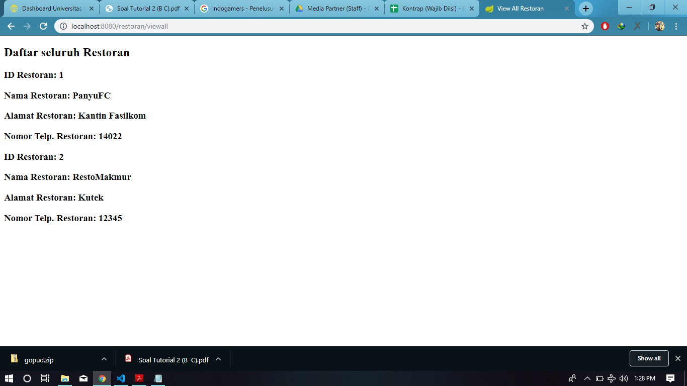

----
## Tutorial 1
### What I have learned today
(Masukkan pertanyaan yang diikuti jawaban di setiap nomor, contoh seperti dibawah. Anda juga boleh
menambahkan catatan apapun dibagian ini)
#### Github
1. Apa itu Issue Tracker? Masalah apa yang dapat diselesaikan dengan Issue Tracker?
Issue Tracker merupakan tempat yang digunakan untuk membahas dan melakukan sebuah tracking terhadap sebuah bug ataupun issue yang sedang ada.
Masalah-masalah yang dapat diselesaikan:
- Request fitur
- Report Bug
- Memperbarui Code
- Improvement atau memperbaiki Code

2. Apa perbedaan dari git merge dan merge --squash?
Perbedaan : 
- ketika melakukan git merge maka setiap commit yang terdapat di branch akan tertulis semua di master
- Sedangkan ketika melakukan merge --squash commit yang terdapat di master hanya akan terdapat 1 commit, dan membuat log lebih bersih
#### Spring
3. Apa itu library & dependency?
- Library
merupakan sebuah code yang telah disediakan dan bisa digunakan oleh pengguna.
-Dependency
merupakan library yang dibutuhkan dalam menjalankan project.
4. Apa itu Maven? Mengapa kita perlu menggunakan Maven?
- Maven meruapakan project manager dependency. Diperlukan karena untuk memanage dan mengkonfigurasi dependency-dependency yang dibutuhkan agar lebih mudah.
5. Apa alternatif dari Maven?
Gradle

### What I did not understand
(tuliskan apa saja yang kurang Anda mengerti, Anda dapat men-_check_ apabila Anda sudah mengerti
dikemudian hari, dan tambahkan tulisan yang membuat Anda mengerti)
- [ ] Kenapa saya harus belajar APAP?
- [x] Kenapa?
Dikarenakan agar dapat mengerti dan memahami bagaimana pembuatan aplikasi bersekala besar. Karena pada dasarnya perancangan aplikasi yang berskala besar dan berskala perorangan sangatlah berbeda.
Apalagi dengan aplikasi yang bersifat enterprise.
